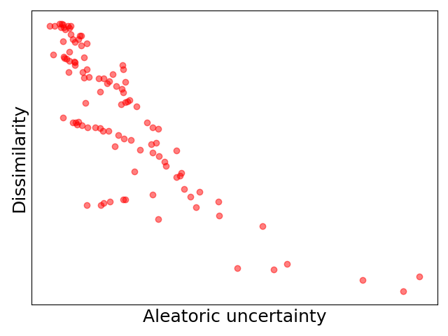
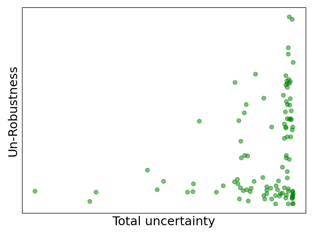

# Uncertainty vs. Robust Explanations

This repository contains the source code used in our study on the relationship between **prediction uncertainty** and the **robustness of explanations**, including both **Counterfactual (cfXp)** and **SHAP (shapXp)** methods.

## 🧠 Introduction

Recent advancements in machine learning have emphasized the need for transparency in model predictions, particularly as interpretability diminishes with increasingly complex architectures. In this work, we propose leveraging **prediction uncertainty** as a complementary approach to classical explainability methods. Specifically, we distinguish between **aleatoric** (data-related) and **epistemic** (model-related) uncertainty to guide the selection of appropriate explanations.

- **Epistemic uncertainty** acts as a rejection criterion for unreliable explanations and provides insight into undertraining.
- **Aleatoric uncertainty** informs the choice between feature-importance and counterfactual explanations.

This framework fosters **uncertainty-aware explainability**, enabling more robust and meaningful interpretations. Our experiments validate the utility of this approach in both classical and deep learning contexts, demonstrating significant gains in the robustness and relevance of explanations.

## 📁 Files Overview

The codebase consists of the following core files:

- `cfXp.py`: Counterfactual explanation implementation  
- `shapXp.py`: SHAP explanation generation  
- `data.py`: Dataset loading and preprocessing  
- `uncertainties.py`: Implementation of uncertainty quantification methods  
- `main.py`: Main script to run experiments

## ⚙️ Set-up

To install all required dependencies, run:

```bash
pip install -r requirements.txt
```

Ensure you are using a Python environment (e.g., `venv`) for better reproducibility.

## 🚀 Usage

Run the main script to launch experiments using different datasets, explanation methods, and uncertainty estimation approaches.

### 🔧 Single Dataset

To run the pipeline on a specific dataset:

```bash
python main.py --dataset dataset_name
```

Replace `dataset_name` with any given dataset (e.g., `PARKINSON`, `WINE`, `HEART`, etc.).

### 📊 All Datasets

To run the pipeline on **all available datasets**:

```bash
python main.py --all
```

This is useful for benchmarking and comparative analysis across datasets.

## 📌 Example (LIVER Dataset)

A simple example using the **LIVER** dataset is available in the codebase. Run the pipeline below and use the generated graphs to understand how uncertainty is related to Counterfactual and SHAP explanations.

```bash
python main.py --dataset LIVER
```
### Counterfactual Explanations Dissimilarity


### SHAP Explanations Un-Robustness


## 📚 References

- A. Hoarau, B. Quost, S. Destercke, W. Waegeman,  
  *Reducing aleatoric and epistemic uncertainty through multi-modal data acquisition*, 2025.
  [https://arxiv.org/abs/2501.18268](https://arxiv.org/abs/2501.18268)

- A. Hoarau, V. Lemaire, Y. Le Gall, J.-C. Dubois, A. Martin,  
  *Evidential uncertainty sampling strategies for active learning*, Machine Learning, 2024.

- T. Denœux,  
  *A k-nearest neighbor classification rule based on Dempster-Shafer theory*,  
  IEEE Transactions on Systems, Man, and Cybernetics, 1995.

- T. Denœux,  
  *A neural network classifier based on Dempster-Shafer theory*,  
  IEEE Transactions on Systems, Man, and Cybernetics, 2000.

- Z. Tong, P. Xu, T. Denœux,  
  *An evidential classifier based on Dempster-Shafer theory and deep learning*,  
  Neurocomputing, 2021.

- K. He, X. Zhang, S. Ren, J. Sun,  
  *Deep Residual Learning for Image Recognition*,  
  In Proceedings of the IEEE Conference on Computer Vision and Pattern Recognition (CVPR), 2016.

- Y. Sun, Y. Ming, X. Zhu, Y. Li,  
  *Out-of-Distribution Detection with Deep Nearest Neighbors*,  
  arXiv:2204.06507, 2022. [https://arxiv.org/abs/2204.06507](https://arxiv.org/abs/2204.06507)

- D. Alvarez-Melis, T. S. Jaakkola,  
  *On the robustness of interpretability methods*, 2018.  
  [https://arxiv.org/abs/1806.08049](https://arxiv.org/abs/1806.08049)

- M. Pawelczyk, K. Broelemann, G. Kasneci,  
  *Learning model-agnostic counterfactual explanations for tabular data*,  
  In Proceedings of The Web Conference 2020 (WWW ’20), pp. 3126–3132, ACM, 2020.  
  ISBN 9781450370233.

- D. Dua, C. Graff,  
  *UCI Machine Learning Repository*, 2017.  
  [https://archive.ics.uci.edu/](https://archive.ics.uci.edu/)


## ⚠️ Note

The code-associated paper is **not yet published**. If you use or reference this code, please make sure to **clearly indicate this status**.

